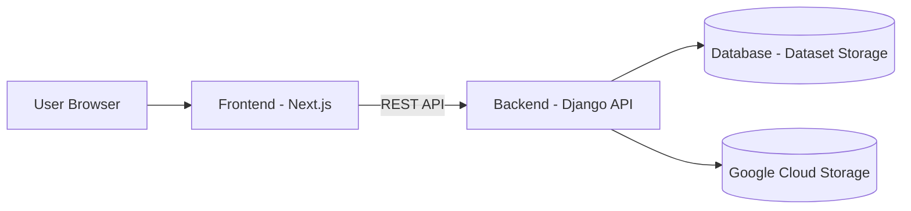

# VizShare

VizShare is a web application that allows you to upload CSV data,
visualize it as interactive charts, and share it with others.

The project focuses on time-series data and aims to make data sharing
and visualization simple and reproducible.

## Features

### ✅ Implemented (MVP Core)

- Upload CSV files (time-series data)
- Automatic parsing of uploaded data (schema detection, time handling)
- Interactive visualization of time-series datasets

### 🚧 In Progress / Planned

- Share datasets and visualizations among users
- Additional visualization features

## Project Status

VizShare is currently in early development (MVP stage).

The core functionality — CSV upload, parsing, and visualization — is implemented
and working as a minimum viable product. The project is under active development,
and APIs, data models, and features may change.

## Live Demo

You can try the MVP of VizShare at:

https://vizshare.vercel.app/

⚠️ Note: VizShare is currently in early development (MVP stage).  
Some features and UI elements are still under construction, so you may encounter minor inconsistencies.

### Demo Account

Use the following account to log in and test CSV upload and visualization:

| Username  | Password |
| --------- | -------- |
| demo_user | demo1234 |

Feel free to explore the app using this account.

## Screenshots

_(Screenshots will be added once the UI is more polished)_

## Tech Stack

- Backend: Django
- Frontend: React / Next.js
- Infrastructure: Terraform
- Storage: Google Cloud Storage (CSV file storage)

## Architecture

### System Overview

VizShare uses a frontend–backend architecture for data upload,
processing, and visualization.

### Data Flow

1. User uploads a time-series CSV file.
2. Backend parses and validates the dataset.
3. Processed data is stored as structured datasets.
4. Frontend renders interactive charts from stored data.

> Note: Uploaded CSV files are stored in Google Cloud Storage to handle large datasets efficiently and enable easy sharing.

## Repository Structure

- `backend/` – Django backend application
- `frontend/` – Frontend application
- `infra/` – Infrastructure as code (Terraform)

## License

This project is licensed under the MIT License.
See [LICENSE](LICENSE) for details.

## Development Documentation

- [Development Documentation](docs/) — project specifications, design documents, and development setup
