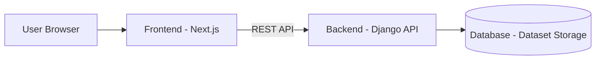

# VizShare

VizShare is a web application that allows you to upload CSV data,
visualize it as interactive charts, and share it with others.

The project focuses on time-series data and aims to make data sharing
and visualization simple and reproducible.

## Features

### ✅ Implemented (MVP Core)

- Upload CSV files (time-series data)
- Automatic parsing of uploaded data (schema detection, time handling)
- Interactive visualization of time-series datasets

### 🚧 In Progress / Planned

- Share datasets and visualizations among users
- Additional visualization features

## Project Status

VizShare is currently in early development (MVP stage).

The core functionality — CSV upload, parsing, and visualization — is implemented
and working as a minimum viable product. The project is under active development,
and APIs, data models, and features may change.

## Tech Stack

- Backend: Django
- Frontend: React / Next.js
- Infrastructure: Terraform

## Architecture

### System Overview

VizShare uses a frontend–backend architecture for data upload,
processing, and visualization.

### Data Flow

1. User uploads a time-series CSV file.
2. Backend parses and validates the dataset.
3. Processed data is stored as structured datasets.
4. Frontend renders interactive charts from stored data.

## Repository Structure

- `backend/` – Django backend application
- `frontend/` – Frontend application
- `infra/` – Infrastructure as code (Terraform)

## License

This project is licensed under the MIT License.
See [LICENSE](LICENSE) for details.

## Development Documentation

- [Development Documentation](docs/) — project specifications, design documents, and development setup

---

## 使用技術

- Django REST Framework, Next.js（App Router）, PostgreSQL
- Vercel / Render（デプロイ環境）
- GitHub Actions（定期バッチ処理）
- Terraform（バックエンドインフラ管理）

---

## 主な変更点（v1 → v2）

- フロントエンドを Next.js に置き換え、Vercel でデプロイ
- バックエンドのインフラを Terraform で管理

---

## 機能

- 気温データの時系列グラフ表示
- 国別 CO₂ 排出量の色分けマップ表示（年度スライダー対応）
- JWT による認証・ログイン/ログアウト
- [Our World in Data（OWID）](https://ourworldindata.org/) の気候データを定期取得

## 開発中の機能

- CSV アップロードによるユーザーデータの可視化
  - 時系列データに対応
  - アップロード・整形後にグラフ表示

---

## デプロイ URL

1. **推奨環境**  
   [Vercel フロント / Google Cloud バック](https://vizshare.vercel.app/)  
   ※バックエンドはスリープ復帰に時間がかかる場合があります（目安：最大約 20~25 秒）。

2. **代替環境（Render のみ）**  
   [Render フロント＆バック](https://vizshare.onrender.com/)  
   ※フロントは最大 40 秒、バックエンドは最大 50~60 秒かかる場合があります。

---

## デモ用アカウント（ポートフォリオ閲覧用）

※ 本アプリはログインが前提です。動作確認には以下アカウントをご利用ください。

| ユーザー名  | メールアドレス   | パスワード       |
| ----------- | ---------------- | ---------------- |
| demo_user   | demo@example.com | climate-demo-123 |

---

## 気温変化グラフ

---

## CO₂ 排出量マップ（年度スライダー）

年度スライダーを動かすと各国の色分けが変化します。（自動再生機能あり）

---

## ドキュメント

詳細なシステム構成や設計案は [docs/README.md](docs/README.md) を参照してください。  
※設計案は開発構想を含むため、実装と完全には一致しない場合があります。
