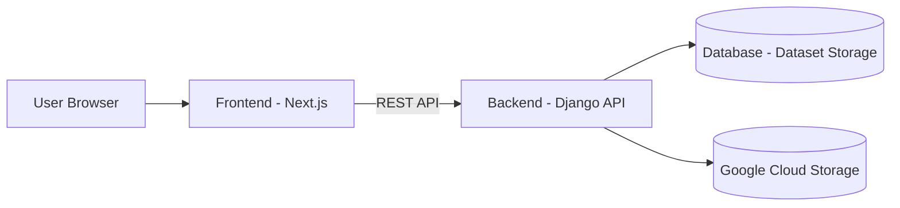

# VizShare

VizShare is a web application that allows users to upload CSV datasets,
visualize them as interactive charts, and share datasets through a public dataset gallery.

The application focuses on time-series data and provides a simple workflow for data visualization and sharing.

## Features

### Core Features

- Upload CSV files (time-series data)
- Automatic parsing of uploaded data (schema detection, time handling)
- Interactive visualization of time-series datasets
- Browse and visualize public datasets
- CSV download for shared datasets

## Live Demo

Try VizShare here:

https://vizshare.vercel.app/

### Demo Account

Use the following account to explore the application,
including CSV upload, visualization, and dataset sharing:

| Username  | Password |
| --------- | -------- |
| demo_user | demo1234 |

You can use this account to explore the application.

## Screenshots

### Time-Series Visualization

Interactive charts for exploring time-series data across entities and metrics.

### CSV Upload & Schema Detection

Parses CSV headers and identifies candidate time, entity, and metric columns, with basic automatic pre-selection based on common keywords.

## Tech Stack

- Backend: Django
- Frontend: React / Next.js
- Infrastructure: Terraform
- Storage: Google Cloud Storage (CSV file storage)

## Architecture

### System Overview

VizShare uses a frontend–backend architecture for data upload,
processing, and visualization.

```mermaid
flowchart LR
    User[User Browser]
    Frontend[Frontend - Next.js]
    Backend[Backend - Django API]
    DB[(Database - Dataset Storage)]
    GCS[(Google Cloud Storage)]

    User --> Frontend
    Frontend -->|REST API| Backend
    Backend --> DB
    Backend --> GCS
```

### Data Flow

1. User uploads a time-series CSV file.
2. Backend parses and validates the dataset.
3. Processed data is stored as structured datasets.
4. Datasets may be published to the public dataset gallery.
5. Users explore datasets and visualize them as interactive charts.
6. Original CSV files can be downloaded from dataset pages.

## Repository Structure

- `backend/` – Django backend application
- `frontend/` – Frontend application
- `infra/` – Infrastructure as code (Terraform)

## License

This project is licensed under the MIT License.
See [LICENSE](LICENSE) for details.

## Development Documentation

- [Development Documentation](docs/) — project specifications, design documents, and development setup
