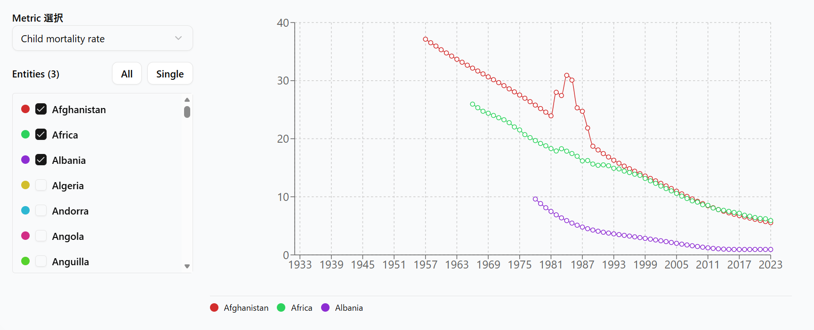
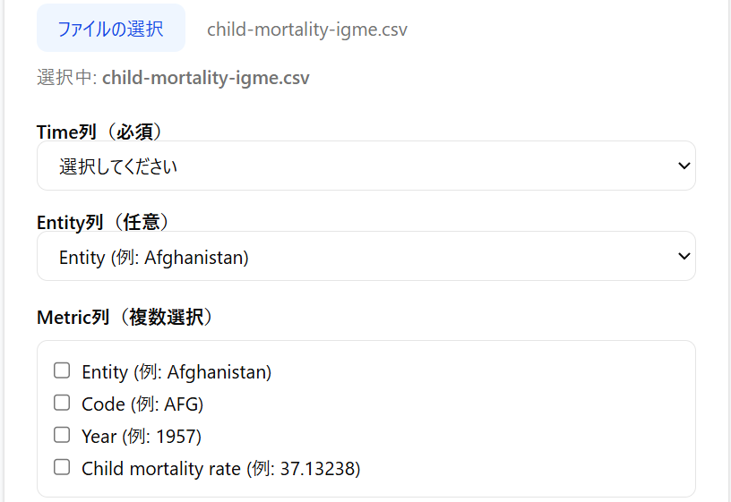
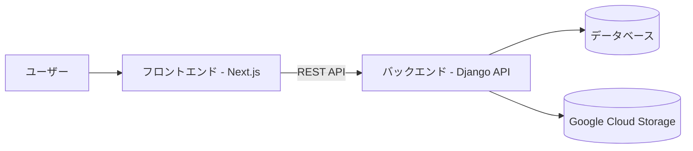

# VizShare

**English version is available in [README.en.md](README.en.md).**

VizShare は、CSV データセットをアップロードし、インタラクティブなグラフで可視化し、公開データセットとして共有できる Web アプリケーションです。

時系列データの可視化に特化しており、CSV のアップロードから可視化、共有までをシンプルな操作で行えます。

ログインしなくても利用できますが、匿名でアップロードしたデータセットは一時的な保存となります。

## 主な機能

### コア機能

- CSV ファイル（時系列データ）のアップロード
- CSV データの自動解析（スキーマ検出・日時データの解析）
- 時系列データのインタラクティブな可視化
- 公開データセットの閲覧・可視化
- 共有データセットの CSV ダウンロード

## デモ

以下の URL からアプリをお試しいただけます。

https://vizshare.vercel.app/

### デモアカウント

CSV データを長期間保存したい場合は、以下のデモアカウントをご利用ください。

| ユーザー名 | パスワード |
| ---------- | ---------- |
| demo_user  | demo1234   |

もちろん、サインアップページから新しいアカウントを作成することもできます。

## スクリーンショット

### 時系列データの可視化

エンティティやメトリクスを切り替えながら、時系列データをインタラクティブに可視化できます。

### CSV アップロード・スキーマ検出

CSV のヘッダーを解析し、日時列・エンティティ列・メトリクス列の候補を検出します。一般的な列名については自動で選択候補を設定します。

## 技術スタック

- バックエンド: Django
- フロントエンド: React / Next.js
- インフラ: Terraform
- ストレージ: Google Cloud Storage（CSV ファイル保存）

## アーキテクチャ

### システム構成

VizShare は、フロントエンドとバックエンドを分離した構成を採用し、CSV のアップロード・解析・可視化を行います。

```mermaid
flowchart LR
    User[ユーザー]
    Frontend[フロントエンド - Next.js]
    Backend[バックエンド - Django API]
    DB[(データベース)]
    GCS[(Google Cloud Storage)]

    User --> Frontend
    Frontend -->|REST API| Backend
    Backend --> DB
    Backend --> GCS
```

### データの流れ

1. ユーザーが時系列データの CSV ファイルをアップロードします。
2. バックエンドが CSV を解析し、データを検証します。
3. 解析済みのデータをデータセットとして保存します。
4. データセットは公開設定を行うことで公開ギャラリーに掲載できます。
5. 他のユーザーは公開データセットを閲覧・可視化できます。
6. データセットページから元の CSV ファイルをダウンロードできます。

## リポジトリ構成

- `backend/` - Django バックエンド
- `frontend/` - React / Next.js フロントエンド
- `infra/` - Terraform によるインフラ構成

## ライセンス

このプロジェクトは MIT License のもとで公開されています。

詳細は [LICENSE](LICENSE) をご覧ください。

## 開発ドキュメント

- [開発ドキュメント](docs/) - 設計資料、仕様書、開発環境の構築手順など
