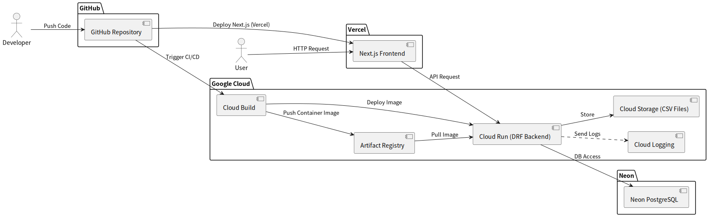
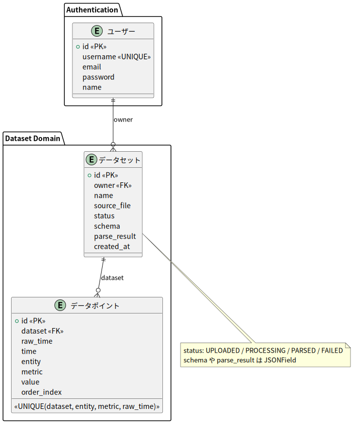

# Vizshare app development document

## 1. Project Overview

- **Project's name** Vizshare development project
- **Background:** The app developer created [climate change app](https://github.com/tomoki-shiozaki/climate-change-app-v2), which visualizes temperature anomally and CO2 emissions by graph and map. The temperature data used in the climate change app is prepared by the app developer. One of the motivations of developing this Vizshare app is offering users for uploading their own datas, then visualizing their datas by gragh, and sharing these datas with other users.
- **Purpose:**
  This app's purposes are the following:
  1. Users can share their datas by visualized forms.
  2. Users can communicate with comment features.
- **MVP Implementation**
  - Uploading, parseing, visualizing datas.
  - Shareing datas

---

## 2. システム構成図（アーキテクチャ）

本プロジェクトの全体構成は以下の通りです。  
フロントエンド、バックエンド、データベース、定期バッチ処理の関係を示しています。

### 説明

- **フロントエンド**：React + Render
- **バックエンド**：Django REST Framework + Cloud Run
- **データベース**：Neon PostgreSQL
- **定期バッチ**：GitHub Actions が OWID API からデータを取得し DB に保存
- **CI/CD**：Cloud Build → Artifact Registry → Cloud Run、フロントは Render に自動デプロイ
- **ログ**：Cloud Logging を利用

---

## 2.1 ER図

- Region / Indicator / ClimateData を中心とした時系列データモデル
- IndicatorGroup による指標分類
- User は現在は認証専用

---

## 3. ターゲットユーザー

- 気候変動に関心のある一般ユーザー・学生・学習者
- 各国のデータを比較・観察したい人
- 環境問題を「データから」理解したい層

---

## 4. 利用シーンの想定

- 世界全体または特定地域（北半球・南半球）の気温変化をグラフで確認
- CO₂ 排出量の推移を年単位で可視化

---

## 5. 機能定義

### 🔹 基本機能（MVP）

#### 1. データ取得（バックエンド）

- Our World in Data の CSV/API から定期的にデータを取得
- GitHub Actions から Django 管理コマンドを実行して自動更新
- データ正規化・欠損補完などの前処理を実施

#### 2. データ保存・API 提供

- Django モデルを定義し、PostgreSQL に保存
- 指標・地域・年をキーとする構造化データ設計
- Django REST Framework で API を構築
  - `/api/temperature/`
  - `/api/co2/`

#### 3. データ可視化（フロントエンド）

- React + Recharts による折れ線グラフ表示
- 気温グラフ：セレクトボックスで地域を切り替え
- CO₂ 排出量マップ：年スライダーで排出量推移を可視化
- 年次推移をインタラクティブに表示

#### 4. 解説セクション

- 簡易な説明と出典（Our World in Data）へのリンクを設置

---

## 6. 使用技術スタック

| 分類           | 技術                                                     |
| -------------- | -------------------------------------------------------- |
| フロントエンド | React, TypeScript, Recharts, React Leaflet, Tailwind CSS |
| バックエンド   | Django, Django REST Framework                            |
| データベース   | PostgreSQL                                               |
| インフラ       | Docker, docker-compose                                   |
| デプロイ       | Google Cloud / Render                                    |
| テスト         | pytest, Vitest                                           |
| バージョン管理 | Git, GitHub                                              |

## 補足

本プロジェクトは [v1 の可視化アプリ](https://github.com/tomoki-shiozaki/climate-change-app)を基にしています。  
v2 では Next.js を採用し、フロント・バックエンド構成を刷新するとともに、  
将来的にはユーザー CSV アップロード型の汎用可視化機能を開発中です。
