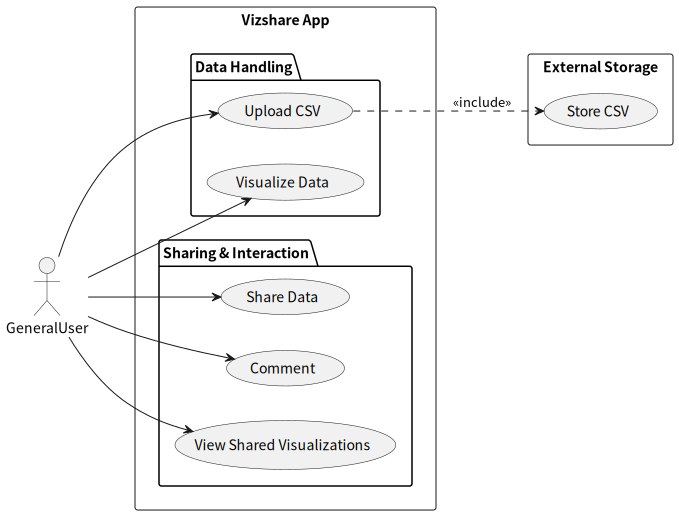
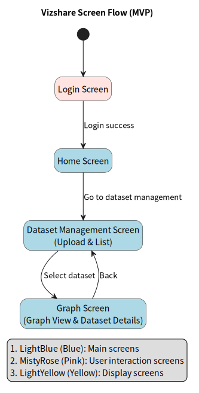

# Vizshare Documentation

## Overview

This directory contains design notes, specifications, and development documentation for Vizshare.

## Documentation Index

- **Specifications & design**
  - This document (overall project design)
  - [Time Series CSV Specification (v1)](./csv-timeseries-spec.md)
- **Development setup**
  - [Local development setup](./development.md)
- **Infrastructure & Terraform**
  - (internal / personal notes)

---

## 1. Project Overview

- **Project name:** Vizshare
- **Background:** The developer previously created [Climate Change App](https://github.com/tomoki-shiozaki/climate-change-app-v2), which visualizes temperature anomalies and CO2 emissions using graphs and maps. The temperature data used in the Climate Change App was prepared by the developer. One of the motivations for developing Vizshare is to allow users to upload their own data, visualize it in graphs, and share it with others.
- **Purpose:** The purposes of this app are:
  1. To allow users to share their data in visualized forms.
  2. To enable users to communicate through comments.
- **MVP Implementation:**
  - Uploading, parsing, and visualizing data.
  - Sharing data with others.

## 2. Requirements

| ID  | Requirement    | Description                                                     | Priority | Notes                     |
| --- | -------------- | --------------------------------------------------------------- | -------- | ------------------------- |
| R1  | Upload CSV     | Users can upload CSV files containing their own data            | High     | MVP                       |
| R2  | Parse Data     | System parses CSV and extracts time, entity, and metric columns | High     | MVP: only numeric metrics |
| R3  | Visualize Data | Display data in graphs (line, bar, etc.)                        | High     | MVP: basic line chart     |
| R4  | Share Data     | Users can share visualizations with others                      | Medium   | Planned feature           |
| R5  | Comment        | Users can comment on shared visualizations                      | Medium   | Future feature            |

## 2.1 Use Case Diagram

The following diagram illustrates the main user interactions in Vizshare,
including both MVP functionality and planned features.

---

## 3. ER Diagram

The following diagram shows the main data models and their relationships in Vizshare. It illustrates the user, dataset, and data point models, along with key fields and constraints.

- **User:** Custom user model with an additional `name` field.
- **Dataset:** Stores uploaded CSV datasets, parsing status, schema, and parse results.
- **DataPoint:** Stores individual metric values for each dataset, along with time and entity information. Each combination of dataset, entity, metric, and raw_time is unique.
- **Dataset Status:** UPLOADED / PROCESSING / PARSED / FAILED
- **JSON Fields:** `schema` and `parse_result` are stored as JSONFields.

## 4. System Architecture

The following diagram shows the overall system architecture of Vizshare,
including the frontend, backend, database, storage, and deployment flow.

### Overview

- **Frontend:** Next.js app deployed on Vercel.
- **Backend:** Django REST Framework API deployed on Google Cloud Run.
- **Database:** Neon PostgreSQL for application data and parsed CSV data.
- **Storage:** Google Cloud Storage for uploaded CSV file storage.
- **CI/CD:** GitHub triggers Google Cloud Build for backend deployment.
- **Logging:** Google Cloud Logging collects backend logs.

### Data Flow

1. Users interact with the frontend.
2. The frontend sends API requests to the backend.
3. The backend parses uploaded CSV files.
4. Parsed data is stored in PostgreSQL.
5. Uploaded CSV files are stored in Cloud Storage.

## 5. Screen Flow Diagram

The following diagram shows the main screen transitions in the Vizshare MVP.

## 2. システム構成図（アーキテクチャ）

本プロジェクトの全体構成は以下の通りです。  
フロントエンド、バックエンド、データベース、定期バッチ処理の関係を示しています。

### 説明

- **フロントエンド**：React + Render
- **バックエンド**：Django REST Framework + Cloud Run
- **データベース**：Neon PostgreSQL
- **定期バッチ**：GitHub Actions が OWID API からデータを取得し DB に保存
- **CI/CD**：Cloud Build → Artifact Registry → Cloud Run、フロントは Render に自動デプロイ
- **ログ**：Cloud Logging を利用

---

## 2.1 ER図

- Region / Indicator / ClimateData を中心とした時系列データモデル
- IndicatorGroup による指標分類
- User は現在は認証専用

---

## 3. ターゲットユーザー

- 気候変動に関心のある一般ユーザー・学生・学習者
- 各国のデータを比較・観察したい人
- 環境問題を「データから」理解したい層

---

## 4. 利用シーンの想定

- 世界全体または特定地域（北半球・南半球）の気温変化をグラフで確認
- CO₂ 排出量の推移を年単位で可視化

---

## 5. 機能定義

### 🔹 基本機能（MVP）

#### 1. データ取得（バックエンド）

- Our World in Data の CSV/API から定期的にデータを取得
- GitHub Actions から Django 管理コマンドを実行して自動更新
- データ正規化・欠損補完などの前処理を実施

#### 2. データ保存・API 提供

- Django モデルを定義し、PostgreSQL に保存
- 指標・地域・年をキーとする構造化データ設計
- Django REST Framework で API を構築
  - `/api/temperature/`
  - `/api/co2/`

#### 3. データ可視化（フロントエンド）

- React + Recharts による折れ線グラフ表示
- 気温グラフ：セレクトボックスで地域を切り替え
- CO₂ 排出量マップ：年スライダーで排出量推移を可視化
- 年次推移をインタラクティブに表示

#### 4. 解説セクション

- 簡易な説明と出典（Our World in Data）へのリンクを設置

---

## 6. 使用技術スタック

| 分類           | 技術                                                     |
| -------------- | -------------------------------------------------------- |
| フロントエンド | React, TypeScript, Recharts, React Leaflet, Tailwind CSS |
| バックエンド   | Django, Django REST Framework                            |
| データベース   | PostgreSQL                                               |
| インフラ       | Docker, docker-compose                                   |
| デプロイ       | Google Cloud / Render                                    |
| テスト         | pytest, Vitest                                           |
| バージョン管理 | Git, GitHub                                              |

## 補足

本プロジェクトは [v1 の可視化アプリ](https://github.com/tomoki-shiozaki/climate-change-app)を基にしています。  
v2 では Next.js を採用し、フロント・バックエンド構成を刷新するとともに、  
将来的にはユーザー CSV アップロード型の汎用可視化機能を開発中です。
