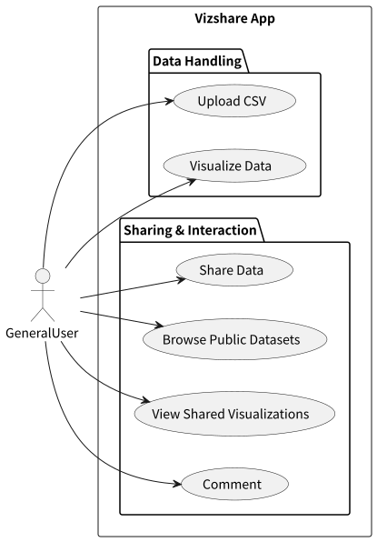
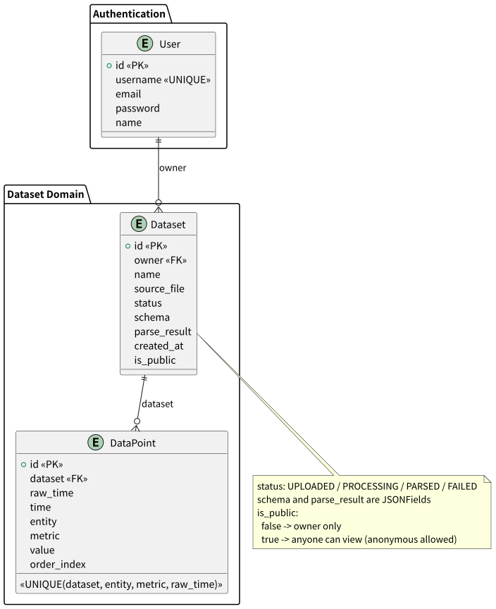
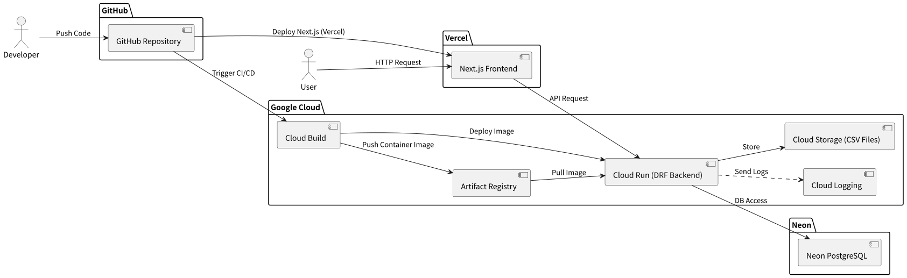
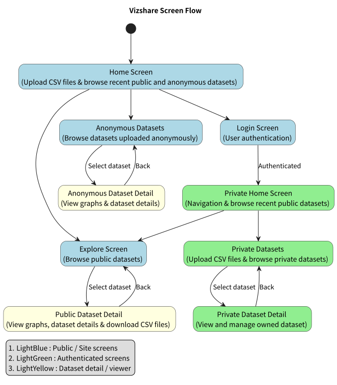

# VizShare 開発ドキュメント

**English version is available in [README.en.md](README.en.md).**

## 概要

このディレクトリには、VizShare の設計資料、仕様書、および開発ドキュメントが含まれています。

## ドキュメント一覧

- **仕様・設計**
  - このドキュメント（プロジェクト全体の概要）
  - [時系列 CSV 仕様（v1）](./csv-timeseries-spec.md)
- **開発環境**
  - [ローカル開発環境の構築](./development.md)

---

## 1. プロジェクト概要

- **プロジェクト名:** VizShare
- **背景:** VizShare は、気候データをグラフや地図で可視化する以前のプロジェクトから着想を得て開発されました。そのコンセプトを発展させ、ユーザー自身が CSV データをアップロードし、可視化・共有できるアプリケーションです。
- **目的:**
  1. ユーザーが CSV データセットをアップロードし、グラフとして可視化できるようにする。
  2. データセットや可視化結果を他のユーザーと共有できるようにする。
  3. 公開されたデータを通じて、データの閲覧や議論を促進する。

---

## 2. 要件

| ID  | 要件             | 説明                                                     | 優先度 | 備考               |
| --- | ---------------- | -------------------------------------------------------- | ------ | ------------------ |
| R1  | CSV アップロード | ユーザーが CSV ファイルをアップロードできる              | 高     |                    |
| R2  | データ解析       | CSV を解析し、日時・エンティティ・メトリクス列を抽出する | 高     | 数値データのみ対応 |
| R3  | データ可視化     | データを折れ線グラフなどで表示する                       | 高     | 基本は折れ線グラフ |
| R4  | データ共有       | データセットを公開ギャラリーへ公開できる                 | 高     |                    |
| R5  | コメント         | 公開データセットへコメントできる                         | 中     | 将来実装予定       |

---

## 2.1 ユースケース図

以下の図は、VizShare における主なユーザー操作（CSV のアップロード、可視化、共有）の流れを示しています。

---

## 3. ER 図

以下の図は、VizShare の主要なデータモデルとその関係を示しています。

- **User:** `name` フィールドを追加したカスタムユーザーモデル
- **Dataset:** アップロードした CSV、解析状態、スキーマ情報、解析結果を管理
- **DataPoint:** データセット内の各時刻・エンティティ・メトリクスの値を管理
- **Dataset Status:** `UPLOADED` / `PROCESSING` / `PARSED` / `FAILED`
- **JSON フィールド:** `schema` と `parse_result` は JSONField として保存

---

## 4. システム構成

以下の図は、VizShare 全体のシステム構成を示しています。

### 概要

- **フロントエンド:** Vercel 上で動作する Next.js アプリケーション
- **バックエンド:** Google Cloud Run 上で動作する Django REST Framework API
- **データベース:** Neon PostgreSQL
- **ストレージ:** Google Cloud Storage（CSV ファイル保存）
- **CI/CD:** GitHub から Google Cloud Build を利用してデプロイ
- **ログ管理:** Google Cloud Logging

### データの流れ

1. ユーザーがフロントエンドを利用する。
2. フロントエンドがバックエンド API を呼び出す。
3. ユーザーが CSV ファイルをアップロードする。
4. バックエンドが CSV を解析・検証する。
5. 解析済みデータを PostgreSQL に保存する。
6. 元の CSV ファイルを Cloud Storage に保存する。

---

## 5. 画面遷移図

以下の図は、VizShare の主要な画面遷移を示しています。

